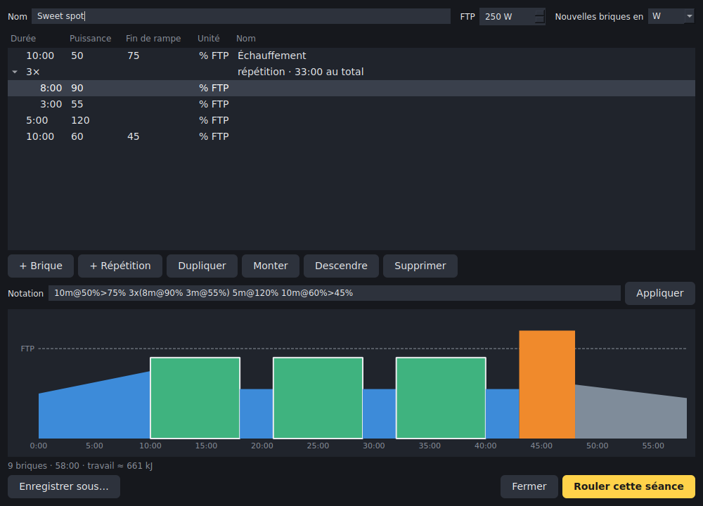
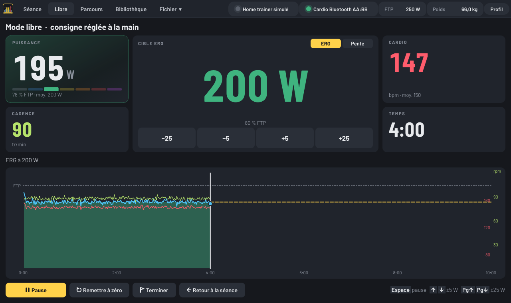
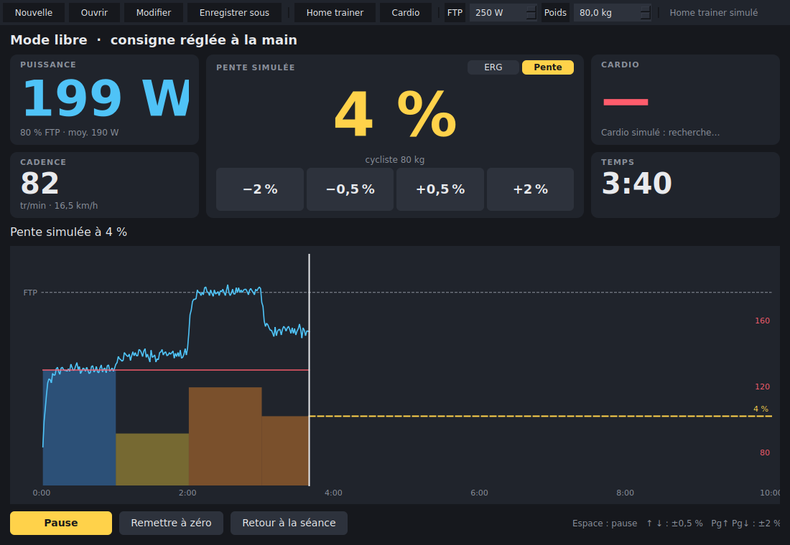

# home-trainer

Logiciel desktop (Python, multiplateforme) pour piloter un home trainer Wahoo
en Bluetooth ou ANT+, lire des séances `.zwo`, `.erg`, `.mrc` (et `.fit`) et
en composer en briques « x min à y watts ».

## État

| Brique | État |
| --- | --- |
| Modèle de séance (briques, rampes, répétitions, cibles W ou % FTP) | ✅ `src/home_trainer/workout.py` |
| Lecture / écriture `.zwo`, `.erg`, `.mrc`, `.fit` | ✅ `src/home_trainer/formats/` |
| Notation texte des briques + ligne de commande | ✅ `bricks.py`, `cli.py` |
| Interface de séance (profil complet, temps restant, puissance, intensité ±1 %) | ✅ `src/home_trainer/ui/`, home trainer simulé |
| Capteur cardiaque Bluetooth et ANT+ (+ simulé), affiché et enregistré | ✅ `src/home_trainer/sensors/` |
| Éditeur graphique de briques, enregistrement .zwo/.mrc/.erg/.fit | ✅ `ui/editor.py` |
| Mode libre : ERG réglé à la main par pas de 5 W, ou pente simulée selon le poids, courbe en direct | ✅ `ui/free_ride.py` |
| Appli Windows avec icône (`HomeTrainer.exe`, raccourci) | ✅ `packaging/` |
| Pilotage Wahoo (Bluetooth FTMS + protocole Wahoo, ANT+ FE-C), mode ERG | ✅ `src/home_trainer/sensors/trainer*.py`, pas encore essayé sur le vrai matériel |

## Lancer l'appli sous Windows (icône)

**Sans rien installer** : ouvrir l'onglet
[Actions](https://github.com/Basile-Desmolin/Home_trainer/actions/workflows/application-windows.yml)
du dépôt, cliquer sur la dernière exécution réussie et télécharger
**HomeTrainer-windows** en bas de page. On obtient `HomeTrainer.exe` (une
cinquantaine de Mo) à poser sur le Bureau : double-clic pour lancer, ou glisser
un fichier de séance dessus pour l'ouvrir directement. Au premier lancement,
Windows peut afficher « Windows a protégé votre ordinateur » (exécutable non
signé) : *Informations complémentaires* → *Exécuter quand même*.

**Avec Python installé** (3.10 ou plus, depuis python.org) : double-clic sur
`packaging\windows\installer-raccourci.bat`. Il installe l'appli dans un
dossier `.venv` du dépôt et crée un raccourci **Home trainer** avec l'icône
sur le Bureau et dans le menu Démarrer. Pour fabriquer soi-même le `.exe` :
`packaging\windows\construire-exe.bat` (résultat dans `dist\`).

## Installation (développement)

```bash
python3 -m venv .venv && source .venv/bin/activate
pip install -e ".[dev]"
pytest
```

## Utilisation

```bash
# Créer une séance (le format suit l'extension)
home-trainer new sweet-spot.zwo --name "Sweet spot" "10m@50%>70% 3x(10m@90% 3m@55%) 10m@60%>40%"
home-trainer new vo2.erg --ftp 250 "15m@150 10x(30s@350 30s@150) 10m@120"

# Lire une séance (Zwift, TrainerRoad, Golden Cheetah, intervals.icu…)
home-trainer show sweet-spot.zwo --ftp 250

# Convertir
home-trainer convert sweet-spot.zwo sweet-spot.erg --ftp 250
```

Notation des briques :

| Écriture | Signification |
| --- | --- |
| `10m@150` ou `10m@150W` | 10 minutes à 150 W |
| `20m@88%` | 20 minutes à 88 % de la FTP |
| `5m30s@200-220` | 5 min 30 s entre 200 et 220 W |
| `10m@100>200` | rampe de 100 à 200 W sur 10 minutes |
| `10m@50%>75%` | rampe de 50 à 75 % de la FTP |
| `10m` | 10 minutes sans cible |
| `open@120` | jusqu'à appui sur « tour », à 120 W |
| `4x(4m@105% 2m@55%)` | répétition (imbrication possible) |

Depuis Python :

```python
from home_trainer.bricks import parse_workout
from home_trainer.formats import load_workout, save_workout

w = parse_workout("10m@150 5x(1m@300 1m@150) 10m@120", name="Test")
save_workout(w, "test.zwo", ftp=250)   # .zwo est en % FTP : la FTP sert à convertir
for seg in load_workout("test.zwo").timeline(ftp=250):
    print(seg.start_s, seg.duration_s, seg.target_w(0))
```

`Workout.timeline(ftp)` déplie les répétitions et donne, pour chaque brique,
son instant de départ et sa cible en watts ; `Segment.target_w(t)` donne la
consigne à l'instant `t` (rampes comprises). C'est l'entrée prévue pour le
mode ERG.

## Interface graphique

Barre d'outils : **Nouvelle…** (Ctrl+N) et **Modifier…** (Ctrl+E) ouvrent
l'éditeur de séance, **Ouvrir…** (Ctrl+O) lit un `.zwo`, `.mrc`, `.erg` ou
`.fit`, **Enregistrer sous…** (Ctrl+S) écrit la séance affichée dans l'un de
ces formats (choisi dans la liste « Type »).



L'éditeur liste les briques : double-clic sur une case pour changer la
durée (`10:00`, `10`, `30s`, `1:30:00`, `tour`), la puissance (`150` ou une
plage `200-220`, vide = libre), la fin de rampe et l'unité (W ou % FTP ;
changer l'unité convertit la valeur avec la FTP). Pour répéter, choisir les
briques (Ctrl + clic ou Maj + clic, au même niveau) puis **Répéter**
(Ctrl+R) et taper le nombre de fois ; choisir des répétitions avec d'autres
briques et **Répéter** à nouveau crée des répétitions de répétitions.
**Dégrouper** défait une répétition. **Monter** / **Descendre** déplacent une
brique ou une répétition, y compris pour la faire entrer dans une répétition
voisine ou en sortir. La notation texte (`3x(4m@105% 2m@55%)`) reste disponible et
synchronisée, et le profil se redessine à chaque modification, brique
choisie entourée. **Rouler cette séance** la charge dans l'écran de séance.

```bash
pip install -e ".[gui]"
home-trainer-gui                       # séance de démo
home-trainer-gui tests/data/velo-route.erg --ftp 250
home-trainer-gui --bricks "10m@150 3x(4m@105% 2m@55%) 10m@110"
```

Profil complet de la séance coloré par zones, curseur d'avancement et
puissance réalisée ; temps restant sur la brique et au total ; puissance,
cible et cadence ; intensité réglable par pas de 1 % (boutons, ou ↑ ↓,
appui long pour défiler). Espace = démarrer / pause, → = brique suivante.

Le home trainer réel et le simulateur (`ui/power.py`) offrent la même
interface `PowerSource` (`set_target`, `read`), voir ci-dessous.
La logique de déroulé (`ui/session.py`) ne dépend pas de Qt et est testée.

### Mode libre

Bouton **Mode libre** (ou Ctrl+L) : pas de séance, on règle la consigne ERG
à la main, en direct, par pas de 5 W (boutons −5 / +5, ou ↑ ↓) et de 25 W
(boutons −25 / +25, ou Page↑ Page↓), appui long pour défiler. Elle part de
60 % de la FTP. Puissance, moyenne, cadence, cardio et temps s'affichent,
avec la courbe des 10 dernières minutes (consigne colorée par zone,
puissance et cardio). En pause, le home trainer repasse en résistance libre.
**Retour à la séance** met le mode libre en pause et retrouve la séance là
où elle en était (Page↑ Page↓ y règlent l'intensité de ±5 %).



**Pente simulée** : le bouton **Pente** (en haut de la cible) remplace l'ERG
par une route en pente, par pas de 0,5 % (↑ ↓) et 2 % (Page↑ Page↓), de
−10 % à +20 %. La résistance dépend alors de la pente, de la vitesse et du
**poids** saisi à côté de la FTP (cycliste ; 9 kg de vélo s'y ajoutent), ou
`--weight 70` au lancement. La vitesse simulée s'affiche sous la cadence.

- ANT+ FE-C : le poids part dans la page 0x37 (configuration utilisateur),
  la pente dans la page 0x33.
- Bluetooth Wahoo (anciens firmwares) : le poids part avec le mode
  simulation, puis la pente.
- Bluetooth FTMS ne transmet pas de poids : le home trainer simule une masse
  fixe, supposée de 75 kg. La pente envoyée est donc ajustée au poids réel
  (× (cycliste + vélo) / 75), ce qui donne le même effort qu'avec ce poids.



## Pilotage du home trainer Wahoo

```bash
pip install -e ".[gui,ble]"            # Bluetooth (bleak)
pip install -e ".[gui,ant]"            # ANT+ (openant) avec une clé USB ANT+
home-trainer-gui --trainer ble         # premier home trainer Bluetooth à portée
home-trainer-gui --trainer ble --trainer-address AA:BB:CC:DD:EE:FF
home-trainer-gui --trainer ant         # premier home trainer ANT+ (ou --trainer-ant-id 12345)
home-trainer-gui --trainer sim         # home trainer simulé (défaut)
```

Il se choisit aussi avec le bouton **Home trainer…** (recherche Bluetooth).
Pédalez pour réveiller le Wahoo et fermez les autres applis qui pourraient
le piloter (Wahoo, Zwift…) : un seul logiciel à la fois peut en prendre le
contrôle. L'état de la connexion s'affiche à droite de la barre d'outils.

- En séance, chaque brique est envoyée en **mode ERG** : le home trainer
  règle la résistance pour tenir la cible, quelle que soit la cadence. Les
  rampes sont suivies watt par watt (au plus une consigne par seconde), un
  changement de brique ou un réglage ±1 % part immédiatement.
- Avant le départ, en pause et en fin de séance, le home trainer passe en
  **résistance libre** (simulation d'une route plate) ; de même quand on
  quitte l'appli, pour ne pas rester bloqué sur la dernière consigne.
- Bluetooth : protocole standard **FTMS** (KICKR, KICKR CORE, SNAP… à jour),
  et en repli le protocole **Wahoo** des anciens firmwares (puissance par le
  service Cycling Power). ANT+ : profil **FE-C**, consigne renvoyée toutes
  les 5 s au cas où un message se perdrait.
- La puissance, la cadence (et la vitesse) mesurées par le home trainer sont
  affichées en permanence, y compris pendant l'échauffement.

Les trames sont encodées et décodées par des fonctions pures
(`sensors/trainer.py`), testées sans matériel (`tests/test_trainer.py`).

## Capteur cardiaque

```bash
pip install -e ".[gui,ble]"            # Bluetooth (bleak)
pip install -e ".[gui,ant]"            # ANT+ (openant) avec une clé USB ANT+
home-trainer-gui --hr ble              # première ceinture Bluetooth à portée
home-trainer-gui --hr ble --hr-address AA:BB:CC:DD:EE:FF
home-trainer-gui --hr ant              # première ceinture ANT+ (ou --hr-ant-id 12345)
home-trainer-gui --hr sim              # cardio simulé (défaut), --hr aucun pour le masquer
```

Le capteur se choisit aussi en cours de route avec le bouton **Cardio…**
(recherche des ceintures Bluetooth à portée). La fréquence s'affiche en
grand avec la moyenne de la séance, et sa courbe se superpose au profil
(échelle en bpm à droite). En cas de perte du signal, l'interface l'indique
et la connexion est retentée automatiquement.

- Bluetooth : service standard Heart Rate (0x180D), compatible avec les
  ceintures Polar, Garmin, Wahoo TICKR, montres en mode diffusion…
- ANT+ : profil HRM (type 120) ; ANT+ nécessite une clé USB (Garmin, CycPlus…)
  et, sous Linux, une règle udev pour y accéder sans être root.
- Le cardio simulé suit la puissance pédalée, avec l'inertie d'un vrai cœur.

`home_trainer.sensors.BackgroundSensor` est le socle commun : connexion
dans un fil dédié, reconnexion, état lisible, dernière mesure (`latest()`)
et péremption d'une mesure trop ancienne. Le pilote Wahoo s'en sert aussi.
Les trames Bluetooth et ANT+ sont décodées par des fonctions pures, testées
sans matériel (`tests/test_sensors.py`).

## Formats

| Extension | Puissance | Ce qui se perd à l'écriture |
| --- | --- | --- |
| `.zwo` (Zwift) | % FTP | plages (→ valeur moyenne) ; répétitions autres que on/off dépliées |
| `.erg` | watts | répétitions dépliées, plages (→ moyenne), noms |
| `.mrc` | % FTP | idem `.erg` |
| `.fit` | watts ou % FTP | rampes écrites en paliers d'une minute |

- Passer des watts au % FTP (ou l'inverse) demande une FTP (`--ftp`), ou celle
  indiquée dans le fichier (`FTP =` des `.erg`/`.mrc`).
- À la lecture, les motifs répétés (`.erg`, `.mrc`, `.zwo`) sont regroupés en
  répétitions, et 0 W est lu comme « pas de consigne » (roue libre).
- Les briques ouvertes (`open`) ne s'écrivent qu'en `.fit`.

## Choix techniques

- **`.zwo`, `.erg`, `.mrc`** : code maison, sans dépendance (`formats/zwo.py`,
  `formats/erg.py`).
- **Lecture `.fit`** : SDK officiel Garmin (`garmin-fit-sdk`), qui gère tout
  le protocole (CRC, en-têtes compressés, champs développeur).
- **Écriture `.fit`** : encodeur maison (`formats/fit_encoder.py`), car le SDK Python
  de Garmin ne sait pas écrire. Les fichiers produits sont validés par le
  décodeur officiel dans les tests.
- Puissance dans le fichier : `0..1000` = % FTP, `> 1000` = watts + 1000
  (convention FIT). Les cibles en zones, durées en distance et répétitions
  conditionnelles d'autres plateformes sont approximées, avec un
  avertissement.
- Interface **PySide6 (Qt)**, Bluetooth via **bleak** (FTMS, et le service
  Wahoo propriétaire en repli), ANT+ via **openant** (profil FE-C) avec une
  clé USB ANT+.
