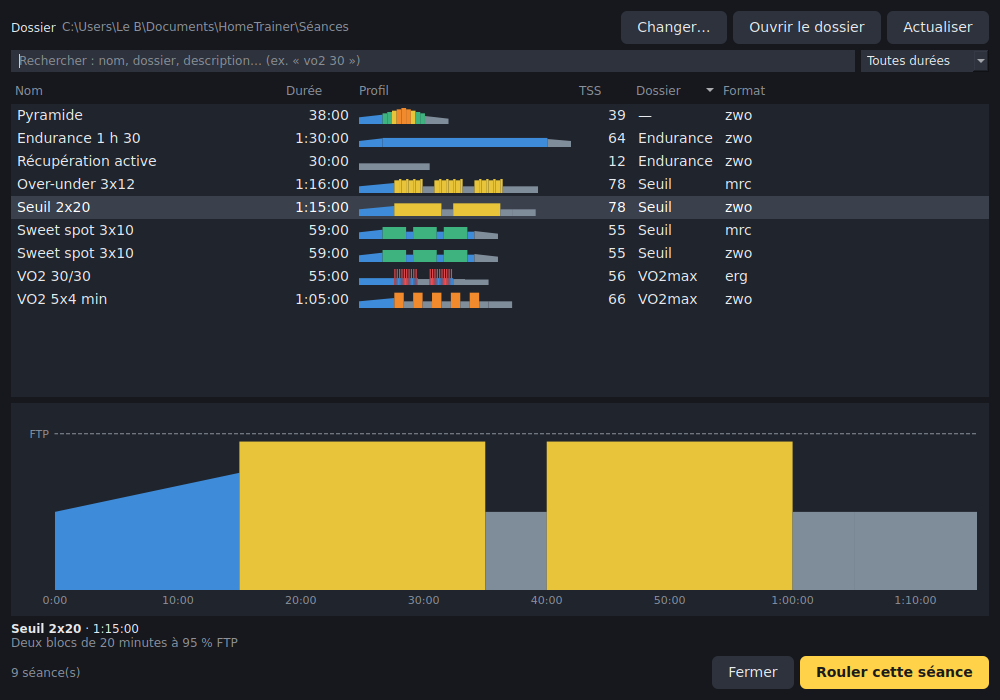
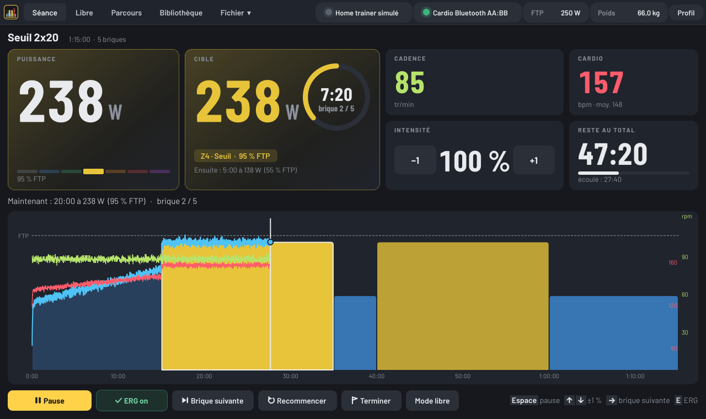
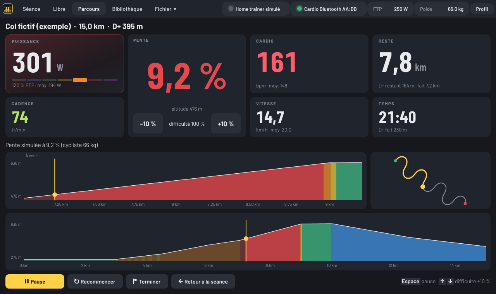
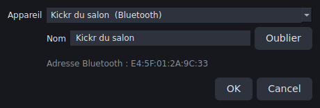
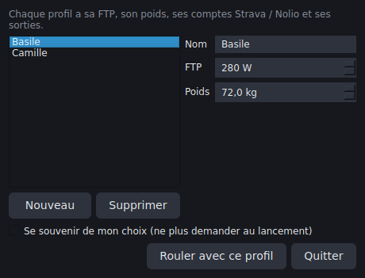
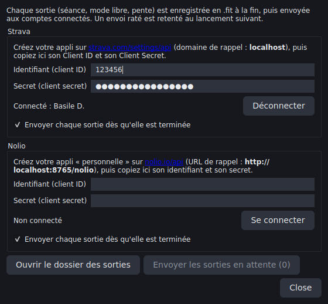
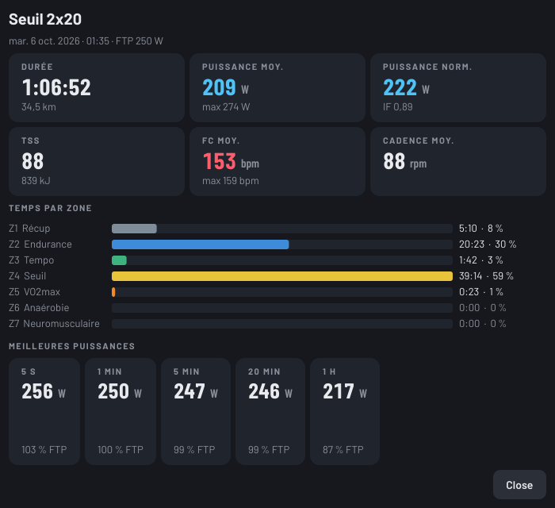
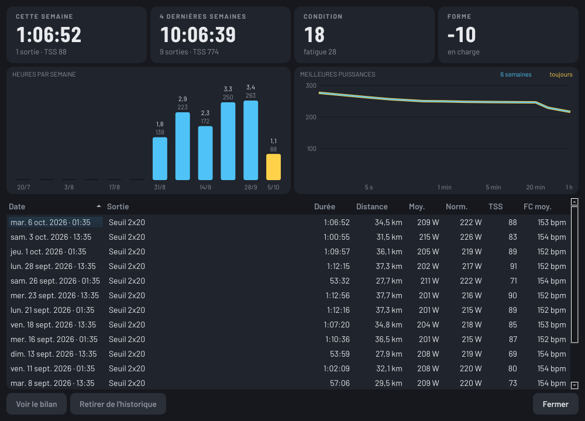

# home-trainer

Logiciel desktop (Python, multiplateforme) pour piloter un home trainer
connecté (Wahoo, Elite, Tacx, Saris… : Bluetooth FTMS ou ANT+ FE-C), lire des séances `.zwo`, `.erg`, `.mrc` (et `.fit`) et
en composer en briques « x min à y watts ».

## État

| Brique | État |
| --- | --- |
| Modèle de séance (briques, rampes, répétitions, cibles W ou % FTP) | ✅ `src/home_trainer/workout.py` |
| Lecture / écriture `.zwo`, `.erg`, `.mrc`, `.fit` | ✅ `src/home_trainer/formats/` |
| Notation texte des briques + ligne de commande | ✅ `bricks.py`, `cli.py` |
| Interface de séance (profil complet, temps restant, puissance, intensité ±1 %) | ✅ `src/home_trainer/ui/`, home trainer simulé |
| Capteur cardiaque Bluetooth et ANT+, affiché et enregistré (« Off » sans fréquence) | ✅ `src/home_trainer/sensors/` |
| Éditeur graphique de briques, enregistrement .zwo/.mrc/.erg/.fit | ✅ `ui/editor.py` |
| Bibliothèque : séances d'un dossier (sous-dossiers compris), recherche, filtre de durée, aperçu | ✅ `library.py`, `ui/library.py` |
| Mode libre : ERG réglé à la main par pas de 5 W, ou pente simulée selon le poids, courbe en direct | ✅ `ui/free_ride.py` |
| Parcours GPX : pente de la route simulée selon la distance parcourue, profil, carte | ✅ `route.py`, `ui/route_ride.py` |
| Appli Windows avec icône (`HomeTrainer.exe`, raccourci) | ✅ `packaging/` |
| Pilotage du home trainer, toutes marques (Bluetooth FTMS + ancien protocole Wahoo, ANT+ FE-C), mode ERG | ✅ `src/home_trainer/sensors/trainer*.py`, pas encore essayé sur le vrai matériel |
| Appareils mémorisés, renommables, reconnexion au lancement | ✅ `src/home_trainer/devices.py` |
| Profils de cyclistes (FTP, poids, comptes Strava / Nolio, sorties), choisis au lancement | ✅ `profiles.py`, `ui/profiles.py` |
| Chaque sortie enregistrée en `.fit` d'activité, envoi automatique vers Strava et Nolio | ✅ `formats/fit_activity.py`, `sync/` |
| Calibration (spindown) guidée : pastille *Home trainer* → *Calibrer…* (FTMS, protocole Wahoo, ANT+ FE-C) | ✅ `ui/calibration.py`, pas encore essayée sur le vrai matériel |

## Lancer l'appli sous Windows (icône)

**Sans rien installer** : ouvrir l'onglet
[Actions](https://github.com/Basile-Desmolin/Home_trainer/actions/workflows/application-windows.yml)
du dépôt, cliquer sur la dernière exécution réussie et télécharger
**HomeTrainer-windows** en bas de page. On obtient `HomeTrainer.exe` (une
cinquantaine de Mo) à poser sur le Bureau : double-clic pour lancer, ou glisser
un fichier de séance dessus pour l'ouvrir directement. Au premier lancement,
Windows peut afficher « Windows a protégé votre ordinateur » (exécutable non
signé) : *Informations complémentaires* → *Exécuter quand même*.

**Avec Python installé** (3.10 ou plus, depuis python.org) : double-clic sur
`packaging\windows\installer-raccourci.bat`. Il installe l'appli dans un
dossier `.venv` du dépôt et crée un raccourci **Home trainer** avec l'icône
sur le Bureau et dans le menu Démarrer. Pour fabriquer soi-même le `.exe` :
`packaging\windows\construire-exe.bat` (résultat dans `dist\`).

## Bibliothèque des séances

Onglet **Bibliothèque** (Ctrl+B) : toutes les séances `.zwo`, `.mrc`, `.erg`
et `.fit` d'un dossier et de ses sous-dossiers, avec leur durée, un petit
profil et un TSS approché. La recherche ignore majuscules et accents et porte
sur le nom, le sous-dossier et la description ; un menu filtre par durée. Un
double-clic (ou **Rouler cette séance**) charge la séance.

Le dossier est `Documents\HomeTrainer\Séances` par défaut (créé au premier
lancement) ; **Changer…** en choisit un autre, qui est mémorisé. Les séances
créées dans l'éditeur s'y enregistrent par défaut, et il suffit d'y copier
des fichiers (Zwift, TrainerRoad, intervals.icu…) pour qu'ils apparaissent ;
les fichiers illisibles, comme les sorties `.fit` enregistrées, sont ignorés.



## Installation (développement)

```bash
python3 -m venv .venv && source .venv/bin/activate
pip install -e ".[dev]"
pytest
```

## Utilisation

```bash
# Créer une séance (le format suit l'extension)
home-trainer new sweet-spot.zwo --name "Sweet spot" "10m@50%>70% 3x(10m@90% 3m@55%) 10m@60%>40%"
home-trainer new vo2.erg --ftp 250 "15m@150 10x(30s@350 30s@150) 10m@120"

# Lire une séance (Zwift, TrainerRoad, Golden Cheetah, intervals.icu…)
home-trainer show sweet-spot.zwo --ftp 250

# Convertir
home-trainer convert sweet-spot.zwo sweet-spot.erg --ftp 250
```

Notation des briques :

| Écriture | Signification |
| --- | --- |
| `10m@150` ou `10m@150W` | 10 minutes à 150 W |
| `20m@88%` | 20 minutes à 88 % de la FTP |
| `5m30s@200-220` | 5 min 30 s entre 200 et 220 W |
| `10m@100>200` | rampe de 100 à 200 W sur 10 minutes |
| `10m@50%>75%` | rampe de 50 à 75 % de la FTP |
| `10m` | 10 minutes sans cible |
| `open@120` | jusqu'à appui sur « tour », à 120 W |
| `4x(4m@105% 2m@55%)` | répétition (imbrication possible) |

Depuis Python :

```python
from home_trainer.bricks import parse_workout
from home_trainer.formats import load_workout, save_workout

w = parse_workout("10m@150 5x(1m@300 1m@150) 10m@120", name="Test")
save_workout(w, "test.zwo", ftp=250)   # .zwo est en % FTP : la FTP sert à convertir
for seg in load_workout("test.zwo").timeline(ftp=250):
    print(seg.start_s, seg.duration_s, seg.target_w(0))
```

`Workout.timeline(ftp)` déplie les répétitions et donne, pour chaque brique,
son instant de départ et sa cible en watts ; `Segment.target_w(t)` donne la
consigne à l'instant `t` (rampes comprises). C'est l'entrée prévue pour le
mode ERG.

## Interface graphique

Bandeau du haut : à gauche les onglets **Séance**, **Libre** et **Parcours**,
la **Bibliothèque** et le menu **Fichier** ; à droite, en pastilles, le home
trainer et le cardio (point vert : connecté, orange : connexion en cours ou
signal perdu, gris : simulé ou aucun ; un clic pour en changer), la **FTP** et
le **poids** (à taper ou à la molette) et le **profil**.

Menu **Fichier** : **Nouvelle séance…** (Ctrl+N) et **Modifier la séance…**
(Ctrl+E) ouvrent l'éditeur de séance, **Ouvrir…** (Ctrl+O) lit un `.zwo`,
`.mrc`, `.erg` ou `.fit`, **Enregistrer sous…** (Ctrl+S) écrit la séance
affichée dans l'un de ces formats (choisi dans la liste « Type »).


L'éditeur liste les briques : double-clic sur une case pour changer la
durée (`10:00`, `10`, `30s`, `1:30:00`, `tour`), la puissance (`150` ou une
plage `200-220`, vide = libre), la fin de rampe et l'unité (W ou % FTP ;
changer l'unité convertit la valeur avec la FTP). Pour répéter, choisir les
briques (Ctrl + clic ou Maj + clic, au même niveau) puis **Répéter**
(Ctrl+R) et taper le nombre de fois ; choisir des répétitions avec d'autres
briques et **Répéter** à nouveau crée des répétitions de répétitions.
**Dégrouper** défait une répétition. **Monter** / **Descendre** déplacent une
brique ou une répétition, y compris pour la faire entrer dans une répétition
voisine ou en sortir. La notation texte (`3x(4m@105% 2m@55%)`) reste disponible et
synchronisée, et le profil se redessine à chaque modification, brique
choisie entourée. **Rouler cette séance** la charge dans l'écran de séance.

```bash
pip install -e ".[gui]"
home-trainer-gui                       # séance de démo
home-trainer-gui tests/data/velo-route.erg --ftp 250
home-trainer-gui --bricks "10m@150 3x(4m@105% 2m@55%) 10m@110"
```



Profil complet de la séance coloré par zones (briques passées estompées, brique
en cours cerclée de blanc), curseur d'avancement et puissance réalisée, cadence
(échelle en tr/min à droite) et cardio. Les cartes Puissance et Cible prennent
la couleur de la zone de la brique en cours, la cible affiche sa zone
(« Z4 · Seuil · 95 % FTP ») et la suivante, un anneau se vide avec le temps
restant sur la brique, et la barre des 7 zones sous la puissance allume celle
où l'on roule. Temps restant au total, cadence, cardio ; intensité réglable
par pas de 1 % (boutons, ou ↑ ↓, appui long pour défiler). Espace = démarrer
/ pause, → = brique suivante.

Les chiffres sont en Barlow Condensed et l'interface en Barlow (polices
libres, licence OFL, embarquées dans `ui/assets/fonts`) ; couleurs, feuille
de style et icônes des boutons sont dans `ui/theme.py`.

Bouton **ERG on / off** (ou E) : ERG off, le home trainer passe en
résistance libre (route plate, selon le poids) ; la séance continue de
dérouler et la cible reste affichée pour la suivre à la main avec les
vitesses. ERG on reprend la consigne de la brique en cours.

**Séances en fréquence cardiaque** : certains `.erg` donnent les cibles en FC
(`MINUTES HR`, `BPM`, `HEARTRATE`…). À l'ouverture, une fenêtre propose :
- **Sans ERG** : résistance libre, la FC cible s'affiche (en bpm) et l'on
  règle l'effort avec les vitesses ;
- **En puissance** : chaque cible de FC devient un % FTP d'après la **FC max**
  (gardée dans le profil). La FC au seuil est estimée à 90 % de la FC max et
  les zones de FC de Coggan sont reliées aux zones de puissance
  (`heart_zones.py`) ; la FC cible reste affichée sous la cible en watts.

Pendant une sortie (en cours ou en pause), le PC ne se met pas en veille et
l'écran ne s'éteint pas (Windows) ; le réglage d'alimentation habituel revient
dès la sortie terminée.

Le home trainer réel et le simulateur (`ui/power.py`) offrent la même
interface `PowerSource` (`set_target`, `read`), voir ci-dessous.
La logique de déroulé (`ui/session.py`) ne dépend pas de Qt et est testée.

### Mode libre

Onglet **Libre**, bouton **Mode libre** (ou Ctrl+L) : pas de séance, on règle la consigne ERG
à la main, en direct, par pas de 5 W (boutons −5 / +5, ou ↑ ↓) et de 25 W
(boutons −25 / +25, ou Page↑ Page↓), appui long pour défiler. Elle part de
60 % de la FTP. Puissance, moyenne, cadence, cardio et temps s'affichent,
avec la courbe des 10 dernières minutes (consigne colorée par zone,
puissance et cardio). En pause, le home trainer repasse en résistance libre.
**Retour à la séance** met le mode libre en pause et retrouve la séance là
où elle en était (Page↑ Page↓ y règlent l'intensité de ±5 %).


**Pente simulée** : le bouton **Pente** (en haut de la cible) remplace l'ERG
par une route en pente, par pas de 0,5 % (↑ ↓) et 2 % (Page↑ Page↓), de
−10 % à +20 %. La résistance dépend alors de la pente, de la vitesse et du
**poids** saisi à côté de la FTP (cycliste ; 9 kg de vélo s'y ajoutent), ou
`--weight 70` au lancement. La vitesse simulée s'affiche sous la cadence.

- ANT+ FE-C : le poids part dans la page 0x37 (configuration utilisateur),
  la pente dans la page 0x33.
- Bluetooth Wahoo (anciens firmwares) : le poids part avec le mode
  simulation, puis la pente.
- Bluetooth FTMS ne transmet pas de poids : le home trainer simule une masse
  fixe, supposée de 75 kg. La pente envoyée est donc ajustée au poids réel
  (× (cycliste + vélo) / 75), ce qui donne le même effort qu'avec ce poids.


### Parcours GPX

**Parcours GPX…** (Ctrl+G), **Ouvrir…** ou un `.gpx` glissé sur l'icône :
on roule la trace (Strava, Komoot, Garmin… ; traces `trk` ou itinéraires
`rte`), exemple dans `examples/col-fictif.gpx`. Au départ, le home trainer
reçoit la pente de la route à l'endroit où l'on se trouve, avec le poids
saisi à côté de la FTP.

- **Distance** : elle avance à la vitesse qu'aurait le vélo sur la vraie
  route, calculée depuis la puissance pédalée, la pente et le poids (comme
  Zwift ou Rouvy), donc la même quel que soit le home trainer. En descente,
  on roule même sans pédaler.
- **Pente** : mesurée sur 100 m autour de la position, ce qui gomme le bruit
  des altitudes GPS ; bornée à −10 % / +20 % pour le home trainer.
- **Difficulté** (boutons −10 % / +10 %, ou ↑ ↓) : part de la pente envoyée
  au home trainer, 100 % par défaut. À 50 %, un 10 % se pédale comme un 5 % ;
  la vitesse et la distance suivent toujours la vraie pente.
- Affichage : pente (couleur selon la raideur, descentes en bleu), altitude,
  distance et dénivelé restants, vitesse et moyenne, profil des 2 prochains
  kilomètres, profil complet et carte de la trace avec la position.
- À l'arrivée, le home trainer repasse en résistance libre. **Retour à la
  séance** met le parcours en pause, Ctrl+G ou **Ouvrir…** en lance un autre.



## Pilotage du home trainer

```bash
pip install -e ".[gui,ble]"            # Bluetooth (bleak)
pip install -e ".[gui,ant]"            # ANT+ (openant) avec une clé USB ANT+
home-trainer-gui --trainer ble         # premier home trainer Bluetooth à portée
home-trainer-gui --trainer ble --trainer-address AA:BB:CC:DD:EE:FF
home-trainer-gui --trainer ant         # premier home trainer ANT+ (ou --trainer-ant-id 12345)
home-trainer-gui --trainer sim         # home trainer simulé
home-trainer-gui                       # sans option : le dernier home trainer utilisé (sinon simulé)
```

Il se choisit aussi d'un clic sur la pastille du home trainer, en haut à droite (recherche Bluetooth).
Pédalez pour réveiller le home trainer et fermez les autres applis qui pourraient
le piloter (Zwift, appli de la marque…) : un seul logiciel à la fois peut en prendre le
contrôle. L'état de la connexion s'affiche dans cette pastille.

- En séance, chaque brique est envoyée en **mode ERG** : le home trainer
  règle la résistance pour tenir la cible, quelle que soit la cadence. Les
  rampes sont suivies watt par watt (au plus une consigne par seconde), un
  changement de brique ou un réglage ±1 % part immédiatement.
- Avant le départ, en pause et en fin de séance, le home trainer passe en
  **résistance libre** (simulation d'une route plate) ; de même quand on
  quitte l'appli, pour ne pas rester bloqué sur la dernière consigne.
- Bluetooth : protocole standard **FTMS** (Wahoo KICKR à jour, Elite, Tacx, Saris…),
  et en repli le protocole **Wahoo** des anciens firmwares (puissance par le
  service Cycling Power). ANT+ : profil **FE-C**, consigne renvoyée toutes
  les 5 s au cas où un message se perdrait.
- La puissance, la cadence (et la vitesse) mesurées par le home trainer sont
  affichées en permanence, y compris pendant l'échauffement.

Les trames sont encodées et décodées par des fonctions pures
(`sensors/trainer.py`), testées sans matériel (`tests/test_trainer.py`).

## Appareils mémorisés



Chaque home trainer ou ceinture cardio qui se connecte est **mémorisé** avec
son adresse Bluetooth ou son numéro ANT+ (même choisi en « premier trouvé ») :
il apparaît ensuite en tête de la liste **Appareil** des pastilles
home trainer et cardio. En le choisissant, on peut le **renommer**
(« Kickr du salon », « Ceinture Polar »…, Entrée pour valider) ou
l'**oublier**. Le nom choisi s'affiche dans la pastille et sur la tuile
cardio. Au lancement, l'appli **se reconnecte** d'elle-même aux derniers
appareils choisis ; les options `--trainer` et `--hr` passent outre.

La liste est enregistrée dans `%APPDATA%\HomeTrainer\appareils.json` sous
Windows, `~/.config/home-trainer/appareils.json` ailleurs (variable
`HOME_TRAINER_DEVICES` pour un autre fichier).

## Profils



Au lancement, l'appli demande **qui roule** : on choisit un profil ou on en
crée un (**Nouveau** : nom, FTP, poids). Chaque profil a sa propre **FTP**,
son **poids**, ses **comptes Strava / Nolio** et ses **sorties** (avec leurs
envois en attente) ; les appareils mémorisés et le dossier de la bibliothèque
sont communs. FTP et poids changés dans leurs pastilles (ou dans l'éditeur)
sont gardés dans le profil.

- **Se souvenir de mon choix** : l'appli reprend directement le dernier
  profil, sans demander. Pour changer de cycliste ou décocher, pastille
  **Profil : …** en haut à droite, **Changer de cycliste…**. En changeant de profil, la sortie en
  cours est enregistrée pour le profil d'avant.
- `home-trainer-gui --profile Camille` choisit (ou crée) le profil sans
  demander ; `--ftp` et `--weight` changent alors ses valeurs.
- **Supprimer** retire le profil de la liste, mais ses sorties et ses
  comptes restent sur l'ordinateur.

La liste est dans `profils.json` du dossier de configuration
(`%APPDATA%\HomeTrainer` sous Windows, `~/.config/home-trainer` ailleurs ;
variable `HOME_TRAINER_PROFILES` pour un autre fichier), et chaque profil a
son dossier `profils/<nom>/` avec `comptes.json` et `sorties/`. Au premier
lancement après la mise à jour, les comptes et les sorties déjà là sont
rangés dans un premier profil, « Mon profil », à renommer.

## Sorties enregistrées, envoi vers Strava et Nolio

À la fin de chaque sortie (séance, mode libre en ERG ou en pente, parcours GPX), l'appli
écrit un **`.fit` d'activité** : une mesure par seconde (puissance, cadence,
cardio, vitesse, distance, pente), les pauses, un tour par brique de séance,
et le résumé (moyennes, puissance normalisée, travail). Puis elle l'**envoie
d'elle-même** vers les comptes Strava et Nolio connectés.

Une sortie se termine :

- en fin de séance ou à l'arrivée d'un parcours, d'elle-même ;
- avec le bouton **Terminer** (ou Ctrl+T), en séance, en mode libre ou sur un parcours.

Dans ces deux cas, la fenêtre **Enregistrer la sortie** s'ouvre : format
(**.fit** par défaut, ou .tcx, ou .csv pour un tableur), nom du fichier et
dossier (celui des sorties du profil, ou un autre avec **Parcourir…** ; il est
reproposé la fois suivante). **Ne pas enregistrer** abandonne la sortie,
**Annuler** ramène à la sortie, en pause. Le .fit est celui qui part vers
Strava / Nolio ; avec un autre format, une copie .fit est gardée dans le
dossier des sorties du profil pour l'envoi.

Elle est aussi enregistrée d'elle-même, en .fit dans le dossier des sorties :

- en changeant de séance, avec **Recommencer** / **Remettre à zéro**, ou en
  fermant l'appli (la sortie en cours n'est jamais perdue).

Toute sortie est enregistrée, même courte (seule une sortie sans aucun
pédalage ne l'est pas). Sans vitesse donnée par
le home trainer, elle est calculée comme sur la route (poids saisi, plat ou
pente simulée), ce qui donne aussi la distance.

Le dossier proposé est le dossier `sorties` du profil
(`%APPDATA%\HomeTrainer\profils\<nom>\sorties` sous Windows,
`~/.config/home-trainer/profils/<nom>/sorties` ailleurs) ; bouton **Ouvrir le dossier des sorties** dans la
fenêtre **Strava / Nolio…**. Un envoi raté (pas de réseau, appli fermée
pendant l'envoi) est retenté au lancement suivant, ou avec **Envoyer les
sorties en attente**.



### Bilan de fin de sortie et historique

La fenêtre **Enregistrer la sortie** commence par le **bilan** de la sortie :
durée et distance, puissance moyenne, normalisée et max, IF, TSS, travail (kJ),
FC moyenne et max, cadence moyenne, **temps passé dans chaque zone** de
puissance (Z1 à Z7, de la FTP du profil) et **meilleures puissances** sur 5 s,
1 min, 5 min, 20 min et 1 h. Une meilleure puissance jamais atteinte jusque-là
par le profil est marquée **★ record**.

Chaque sortie enregistrée s'ajoute à l'**historique** du profil (onglet
**Historique** du bandeau ou Ctrl+H) : la liste des sorties (double-clic : leur bilan),
les heures et le TSS des 12 dernières semaines, la **condition** (CTL, charge
des 6 dernières semaines), la **forme** (condition moins fatigue, TSB) et la
courbe des meilleures puissances, de toujours et des 6 dernières semaines. Il est
gardé dans `historique.json` du dossier des sorties du profil ; une sortie
« Ne pas enregistrer » n'y entre pas. **Retirer de l'historique** enlève une
sortie de la liste sans toucher à son fichier.





### Connecter Strava (une fois)

Strava n'accepte les envois que d'une appli API déclarée : chacun crée la
sienne, gratuitement, en deux minutes.

1. Connecté à Strava, ouvrir <https://www.strava.com/settings/api>.
2. Remplir le formulaire : nom (« Home trainer de Basile »), catégorie
   (« Training »), site web (par exemple l'adresse de ce dépôt) et surtout
   **Domaine du rappel d'autorisation : `localhost`**. Strava demande ensuite
   une icône (n'importe quelle image).
3. Copier le **Client ID** et le **Client Secret** affichés dans la fenêtre
   **Strava / Nolio…** de l'appli (pastille **Profil** → **Comptes Strava / Nolio…**), puis **Se connecter** : le navigateur
   s'ouvre sur Strava, accepter « Importer des activités ». C'est fini, la
   page indique « Connexion réussie ».

Les sorties arrivent sur Strava en « vélo », marquées *home trainer*.

### Connecter Nolio (une fois)

Même principe, avec l'API officielle de Nolio
(<https://github.com/NolioApp/NolioAPI-Documentation/wiki>).

1. Ouvrir <https://www.nolio.io/api/> et remplir le formulaire du portail
   développeur (nom, e-mail, logo, usage : « logiciel de home trainer
   personnel »).
2. Créer une appli **personnelle** (jusqu'à 5 comptes, il n'en faut qu'un)
   avec l'**URL de rappel `http://localhost:8765/nolio`**, exactement.
3. Copier l'identifiant (client ID) et le secret dans **Strava / Nolio…**,
   puis **Se connecter** et accepter dans le navigateur.

Nolio met les fichiers reçus dans une file de traitement : la sortie
apparaît dans le calendrier au bout de quelques instants.

### Sécurité

Identifiants et jetons d'accès restent sur l'ordinateur, dans
`comptes.json` du dossier du profil, jamais dans le dépôt. La
connexion passe par le navigateur (OAuth 2) : l'appli ne voit jamais le mot
de passe Strava ou Nolio. **Déconnecter** oublie les jetons.

## Capteur cardiaque

```bash
pip install -e ".[gui,ble]"            # Bluetooth (bleak)
pip install -e ".[gui,ant]"            # ANT+ (openant) avec une clé USB ANT+
home-trainer-gui --hr ble              # première ceinture Bluetooth à portée
home-trainer-gui --hr ble --hr-address AA:BB:CC:DD:EE:FF
home-trainer-gui --hr ant              # première ceinture ANT+ (ou --hr-ant-id 12345)
home-trainer-gui --hr aucun            # sans ceinture cardio
home-trainer-gui                       # sans option : la dernière ceinture utilisée (sinon aucune)
```

Le capteur se choisit aussi en cours de route d'un clic sur la pastille cardio
(recherche des ceintures Bluetooth à portée). La fréquence s'affiche en
grand avec la moyenne de la séance, et sa courbe se superpose au profil
(échelle en bpm à droite). Sans ceinture, ou tant qu'aucune fréquence
n'est reçue, la tuile CARDIO affiche **Off** (séance, mode libre et parcours
GPX). En cas de perte du signal, la connexion est retentée automatiquement.
La fréquence n'est jamais estimée à partir de la puissance.

- Bluetooth : service standard Heart Rate (0x180D), compatible avec les
  ceintures Polar, Garmin, Wahoo TICKR, montres en mode diffusion…
- ANT+ : profil HRM (type 120) ; ANT+ nécessite une clé USB (Garmin, CycPlus…)
  et, sous Linux, une règle udev pour y accéder sans être root.

`home_trainer.sensors.BackgroundSensor` est le socle commun : connexion
dans un fil dédié, reconnexion, état lisible, dernière mesure (`latest()`)
et péremption d'une mesure trop ancienne. Le pilote du home trainer s'en sert aussi.
Les trames Bluetooth et ANT+ sont décodées par des fonctions pures, testées
sans matériel (`tests/test_sensors.py`).

## Formats

| Extension | Puissance | Ce qui se perd à l'écriture |
| --- | --- | --- |
| `.zwo` (Zwift) | % FTP | plages (→ valeur moyenne) ; répétitions autres que on/off dépliées |
| `.erg` | watts (ou FC en bpm) | répétitions dépliées, plages (→ moyenne), noms |
| `.mrc` | % FTP | idem `.erg` |
| `.fit` | watts ou % FTP | rampes écrites en paliers d'une minute |

- Passer des watts au % FTP (ou l'inverse) demande une FTP (`--ftp`), ou celle
  indiquée dans le fichier (`FTP =` des `.erg`/`.mrc`).
- À la lecture, les motifs répétés (`.erg`, `.mrc`, `.zwo`) sont regroupés en
  répétitions, et 0 W est lu comme « pas de consigne » (roue libre).
- Les briques ouvertes (`open`) ne s'écrivent qu'en `.fit`.

## Choix techniques

- **`.zwo`, `.erg`, `.mrc`** : code maison, sans dépendance (`formats/zwo.py`,
  `formats/erg.py`).
- **Lecture `.fit`** : SDK officiel Garmin (`garmin-fit-sdk`), qui gère tout
  le protocole (CRC, en-têtes compressés, champs développeur).
- **Écriture `.fit`** : encodeur maison (`formats/fit_encoder.py`), car le SDK Python
  de Garmin ne sait pas écrire. Les fichiers produits sont validés par le
  décodeur officiel dans les tests.
- Puissance dans le fichier : `0..1000` = % FTP, `> 1000` = watts + 1000
  (convention FIT). Les cibles en zones, durées en distance et répétitions
  conditionnelles d'autres plateformes sont approximées, avec un
  avertissement.
- **`.fit` d'activité** : même encodeur maison (`formats/fit_activity.py`),
  fichiers validés par le décodeur officiel dans les tests.
- **Strava et Nolio** : API officielles en OAuth 2, avec la seule
  bibliothèque standard (`urllib`, petit serveur `http.server` sur
  `localhost:8765` pour recevoir le code de connexion) ; envoi `multipart`
  vers Strava, JSON (fichier en base64) vers Nolio (`sync/`).
- Interface **PySide6 (Qt)**, Bluetooth via **bleak** (FTMS, et le service
  Wahoo propriétaire en repli), ANT+ via **openant** (profil FE-C) avec une
  clé USB ANT+.
